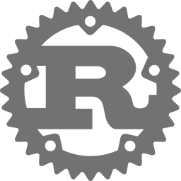

<div align="center">
    
    <h1>
        <strong>ModCLI</strong>
        <sup><br><sub>RUST CLI FRAMEWORK</sup><br></sup>
    </h1>
    <div>
        <a href="https://crates.io/crates/mod-cli" alt="ModCLI on Crates.io"></a>
        <span>&nbsp;</span>
        <a href="https://crates.io/crates/mod-cli" alt="Download ModCLI"></a>
        <span>&nbsp;</span>
        <a href="https://docs.rs/mod-cli" title="ModCLI Documentation"></a>
        <span>&nbsp;</span>
        
        <span>&nbsp;</span>
        
    </div>
</div>
<div>
    <br>
    <p>
        <strong>ModCLI</strong> is a lightweight, modular command-line interface (<b>CLI</b>) framework designed for Rust applications. It provides an extendable core, support for dynamic or static command registration, and clean CLI behavior out of the box — without the bloat or config overhead.
    </p>
    <br>
</div>

<h2>Key Features</h2>
<li>
    <strong>Modular Architecture</strong> – Easily register commands via code, JSON, or plugins.
</li>
<li>
    <strong>Zero-Bloat Core</strong> – Minimal dependencies with clean, readable structure.
</li>
<li>
    <strong>Internal Command Support</strong> – Feature-flag toggled command injection for flexible builds.
</li>
<li>
    <strong>Multiple Binary Support</strong> – Build multiple CLI entry points with different responsibilities.
</li>
<li>
    <strong>Color &amp; Output Utilities</strong> – Includes optional support for formatting, tables, and themes.
</li>
<li>
    <strong>Built for Extension</strong> – Clean integration points for loaders, command sources, output formatting, and more.
</li>

<br>
<h2>Status</h2>

> **Pre-release (v0.1.5)**  
> Active development — core is stable, features are evolving.  
> Production use is possible, but interfaces may still evolve until 1.0.

<br>
<h2>Use Cases</h2>
<li>
    CLI tools that need dynamic or swappable command sets.
</li>
<li>
    Binary apps with internal admin or debugging commands.
</li>
<li>
    Scriptable daemons or language tools (e.g. HiveScript shell, Torque engine).
</li>
<li>
    Systems that need fast, internal-only dev tools during builds.
</li>

<br>
<h2>Example</h2>

```bash
cargo run --bin modcli ping
> Pong!

cargo run --bin modcli --features internal-commands hello James
> Hello, James!
```

<br>

<h2>Feature Flags</h2>

| Feature               | Description                                           |
|------------------------|-------------------------------------------------------|
| `internal-commands`    | Enables built-in test/dev commands like `ping`, `hello` |
| `color`                | Enables CLI output coloring (coming soon)             |
| `json-loader`          | Enables external command loading from JSON config     |
| `frag-support`         | (planned) Integrates with Fragonite-based memory engine |


<br>
<!--
:: LICENSE
============================================================================ -->
<div id="license">
    <hr>
    <h2>📌 License</h2>
    <p>Licensed under the <b>Apache License</b>, version 2.0 (the <b>"License"</b>); you may not use this software, including, but not limited to the source code, media files, ideas, techniques, or any other associated property or concept belonging to, associated with, or otherwise packaged with this software except in compliance with the <b>License</b>.</p>
    <p>You may obtain a copy of the <b>License</b> at: <a href="http://www.apache.org/licenses/LICENSE-2.0" title="Apache-2.0 License" target="_blank">http://www.apache.org/licenses/LICENSE-2.0</a>.</p>
    <p>Unless required by applicable law or agreed to in writing, software distributed under the <b>License</b> is distributed on an "<b>AS IS" BASIS, WITHOUT WARRANTIES OR CONDITIONS OF ANY KIND</b>, either express or implied.</p>
    <p>See the <a href="./LICENSE" title="Software License file">LICENSE</a> file included with this project for the specific language governing permissions and limitations under the <b>License</b>.</p>
    <br>
</div>


<!--
:: COPYRIGHT
============================================================================ -->
<div align="center">
  <br>
  <h2></h2>
  <sup>COPYRIGHT <small>&copy;</small> 2025 <strong>JAMES GOBER.</strong></sup>
</div>